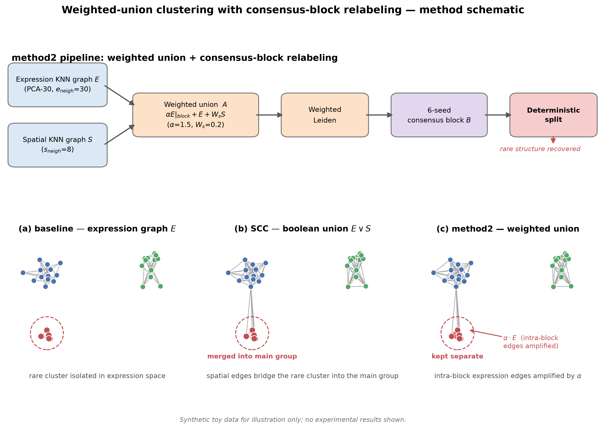

# spatial-clustering-rare-structure-rescue

## 小鼠胚胎空间聚类方法评估与改进（稀有结构救回）

任务 3 的全部方法实现代码。数据集为 **MOSTA E11.5 小鼠胚胎 Stereo-seq**，共 **27,378 个空间 bin**，
金标准为 **19 类解剖学标注**。



<sub>示意图使用合成玩具数据真实计算 KNN 图，仅说明方法机制，不含任何实验结果。生成脚本见
`code/99_tools/make_schematic.py`。</sub>

工作分两部分：

1. **方案评估** —— 在同一套指标下比较非空间聚类（baseline Leiden）、空间约束聚类（SCC）、
   表达平滑、GraphST，量化"空间信息以何种方式融合"对聚类结果的影响。
2. **改进方法（method2）** —— 针对**稀有结构被主群吞并**的问题，提出
   **加权并集 + 共识块重判** 策略，在总体 ARI 基本不损失的前提下恢复背根神经节（DRG）与脊髓（SC）。

---

## 目录结构

```
code/
├── 00_common/                    公共库
│   ├── spateo_loader.py          数据加载
│   ├── fast_leiden.py            Leiden 封装（igraph + leidenalg）
│   └── eval.py                   ARI / NMI / Silhouette / 空间连贯性
├── 01_baseline/                  非空间基线（Leiden on PCA）
├── 02_scc/                       空间约束聚类（Spatial Connectivity Constraint）
├── 03_smooth/                    表达平滑 + 带宽敏感性扫描
├── 04_graphst/                   GraphST 复现（SOTA 参照）
├── 05_method1_bilateral/         方法1：双边核加权 SCC
├── 06_method2_weighted_union/    ★ 最终方法（core 14 + analysis 14 + marking 11 + runs 55）
│   ├── core/                     核心算法与主流程（14 个）
│   │   ├── m2_final_lib.py       ★★ 核心算法库（加权并集 + 共识块拆分）
│   │   ├── m2_scan_lib.py        指标 / 匈牙利匹配 / 空间连贯性 / KNN 构图
│   │   ├── m2_refs.py            参照结果（baseline / scc_s8）读取
│   │   ├── m2_prepare.py         构图：表达二值图、空间二值图、子采样索引
│   │   ├── m2_prepare_f6.py      共识块挖掘（无标注，块大小 ∈ [50,200]）
│   │   ├── m2_regen_annfree.py   无标注版本全流程重生成
│   │   ├── m2_agg.py / m2_reaggregate.py / m2_recompute_05.py   多 seed 聚合
│   │   ├── m2_finalizeA/B/B2.py  出图 / 出表 / 登记表
│   │   └── m2_write_artifacts.py / m2_write_csv.py   产物落盘
│   ├── analysis/                 验证与分析（14 个）
│   │   ├── compute_marking.py    6-seed 共识块计算
│   │   ├── marker_verify.py / m2_marker_verify.py / marker_fig.py   marker 基因验证
│   │   ├── m2_gate.py            alpha 验收门控（DRG 5/5 稳定性判据）
│   │   ├── m2_robust_diag.py / m2_sanity_alpha.py / m2_gold_check.py / m2_range_review.py
│   │   ├── m2_inventory_check.py / m2_smoke.py / drg_seed_check.py
│   │   ├── mech_quantify.py      代价机制量化
│   │   └── method2_compare_fig.py 跨方法对比图
│   ├── marking/                  共识标记的运行脚本（11 个，按 seed 复制）
│   └── runs/                     alpha × resolution × seed 运行网格（55 个自动生成的启动脚本）
└── 99_tools/                     出图 / 登记表 / 数据探查等辅助脚本（23 个）
```

> `runs/`、`marking/` 下的文件是**自动生成的运行副本**（同一程序，仅 `alpha` / `resolution` /
> `seed` 三个数字不同），保留它们是为了记录完整实验网格，不是不同的算法实现。
> **真正的算法源码在 `core/` 与 `analysis/`。**

---

## 方法总览

| 方案 | 空间信息融合方式 | 融合公式 | ARI | NMI | SC/DRG 重叠 |
|---|---|---|---|---|---|
| `baseline_v2_arpack` | 无（仅表达） | `A = E` | 0.4234 | 0.6987 | 1.00 / 0.99 |
| `scc_default` (s=6) | 图拓扑层，布尔并集 | `A = E ∨ S` | 0.3925 | 0.6728 | 0.00 / 0.00 |
| `scc_s8` | 图拓扑层，布尔并集 | `A = E ∨ S` | 0.4437 | 0.6979 | 0.00 / 0.00 |
| `scc_s12` | 图拓扑层，布尔并集 | `A = E ∨ S` | 0.4493 | 0.6749 | — |
| `smooth_s8` | 特征层，乘法融合 | `X' = W̃ X` | 0.2761 | 0.5849 | 0.00 / 0.00 |
| `smooth_s8_incl_self` | 特征层，乘法融合（含自环） | `X' = W̃ X` | 0.2772 | 0.5797 | 0.00 / 0.00 |
| `graphst_reference` | 编码器网络层（GAT + 对比学习） | `Â = D^{-1/2}(A+I)D^{-1/2}` → GAE | 0.3043 | 0.5779 | — |
| `method1_bilateral_spatial_knn` | 边权层，双边核（空间 KNN） | `w_ij = exp(-d_s²/2σ_s²)·exp(-d_e²/2σ_e²)` | 0.1784 | 0.4885 | — |
| `method1_bilateral_expr_knn` | 边权层，双边核（表达 KNN） | 同上 | 0.2909 | 0.6191 | — |
| **`method2_weighted_union_final`** | **图拓扑层 + 加权 + 确定性重判** | **见下节** | **0.4234** | **0.6980** | **1.00 / 0.99** |

指标均在 `resolution = 1.0` 下，method2 为 5 个随机种子（888, 1, 2, 3, 4）的均值。

**关键对照结论**：`scc_s8` / `scc_s12` 的整体 ARI 最高（0.44 / 0.45），但代价是
**脊髓与背根神经节被完全吞并（重叠 0.00 / 0.00）** —— 空间约束在提升整体一致性时，
系统性地把稀有结构抹平。空间平滑与 GraphST 同样如此。**method2 在 ARI 与 baseline 持平
（0.4234）的同时把这两类恢复到 1.00 / 0.99。**

---

## 最终方法（method2）：加权并集 + 共识块重判

### 1. 加权并集邻接矩阵

设 `E` 为表达空间 KNN 二值图（PCA-30，`e_neigh=30`），`S` 为物理空间 KNN 二值图（`s_neigh=8`），
`B` 为共识块（无标注挖掘，块大小 ∈ [50, 200]）。则邻接矩阵为：

```
A_ij = α · E_ij · 1{i, j ∈ 同一保护块}  +  E_ij · 1{否则}  +  W_s · S_ij
```

其中 **α = 1.5**（块内表达边放大系数），**W_s = 0.2**（空间边权重）。

与 SCC 的关键区别：

- SCC 是 `A = E ∨ S`，二值化后**所有边等权**；
- method2 **不重新二值化**，以带权图送入 Leiden，使"同源共识块内部"的表达边获得更高权重，
  从而在谱划分中被优先保留。

### 2. 脊髓的确定性重判

加权 Leiden 收敛到随机最优，稀有结构仍可能被吞并。因此在聚类之后施加一次
**无标注的确定性修正**（SpaGCN `refine` 风格）：

```python
def sc_split_block(lab, sc_block):     # sc_block = 71-bin 无标注共识块
    c = lab[sc_block[0]]
    if (lab[sc_block] == c).all() and (lab == c).sum() == len(sc_block):
        return lab, ...                # 已独立成簇，不动
    lab2 = lab.copy(); lab2[sc_block] = lab.max() + 1
    return lab2, ...                   # 否则强制拆分为独立簇
```

该块**完全由共识表达聚类产生**，只是**恰好**与"脊髓"标注重合（recall = 1.0）；
函数内部**不读取任何标注信息**，标注仅在事后用于评估。因此该方法是无监督的。

### 3. 两种代价机制必须区分报告

- **DRG 恢复** = 纯图权重机制（α 放大块内表达边），未做任何标签修正；
- **SC 恢复** = 图权重 + 确定性标签修正（`sc_split_block`），不依赖 Leiden 的随机最优。

`m2_gate.py` 给出的验收判据：**α = 1.5 时 DRG 在 5 个随机种子下 5/5 稳定恢复**
（overlap ≥ 0.9，均值 0.9924，标准差 0.0）；α = 2 / 3 / 5 均无法达到 5/5。

---

## 运行环境

```bash
pip install -r requirements.txt
```

GraphST 相关脚本需要额外安装：

```bash
pip install GraphST
pip install torch   # 按 CUDA 版本选择
```

## ⚠️ 数据路径

> **数据来源、下载入口、中间产物清单详见 [`DATA.md`](DATA.md)。本仓库不含任何数据。**

### 换机器运行：改一个文件即可

原始脚本中的输入输出路径均为作者本机绝对路径。为便于复现，仓库根目录提供了
**`config.py`（路径与超参数的唯一来源）** 和 **`port_paths.py`（一键改写脚本）**：

```bash
# 1. 编辑 config.py，改这几个变量指向你自己的位置
#    PROJECT_ROOT / WORK_DIR / DATA_H5AD / RESULTS_DIR

# 2. 先预览会改哪些文件（不落盘）
python port_paths.py --check

# 3. 确认后执行；脚本会自动备份 code/ 到 .port_paths_backup/
python port_paths.py

# 改错了可以回滚
python port_paths.py --revert
```

覆盖的路径共 **365 处 / 136 个文件**（`F:/tmp` 141 处、`results/` 97 处、数据 22 处等），
改写为纯文本前缀替换且可逆。

> 注：本仓库交付时脚本内仍是作者本机路径，`port_paths.py` 在你改完 `config.py` 后才会生效。

### 从零复现的顺序

1. 准备 MOSTA E11.5 的 AnnData（含 `obs["annotation"]` 19 类标注、`obsm["spatial"]`，
   下载入口见 [`DATA.md`](DATA.md)）；
2. 跑 `01_baseline/` 得到 baseline 结果与 `baseline_corrected_slim.h5ad`；
3. 跑 `core/m2_prepare.py` 生成 `m2_expr_bin.npz` / `m2_spatial_bin_s8.npz` / `m2_subsample.npy`；
4. 跑 `core/m2_prepare_f6.py` 生成无标注共识块 `m2_f6_protect.npz`；
5. 跑 `core/m2_regen_annfree.py`（或 `runs/` 下的网格）得到各 (α, res, seed) 标签，
   再由 `core/m2_agg.py` / `m2_finalize*.py` 汇总出图出表。

数据文件**未包含在本仓库中**。

## 依赖的上游项目

`spateo_loader.py` 依赖 [Spateo](https://github.com/aristoteleo/spateo-release)（BSD 2-Clause）
的 `spateo.tools.cluster` / `find_neighbors` 实现图谱构建与 SCC。本仓库仅包含作者为本任务
编写的评估与改进代码。
